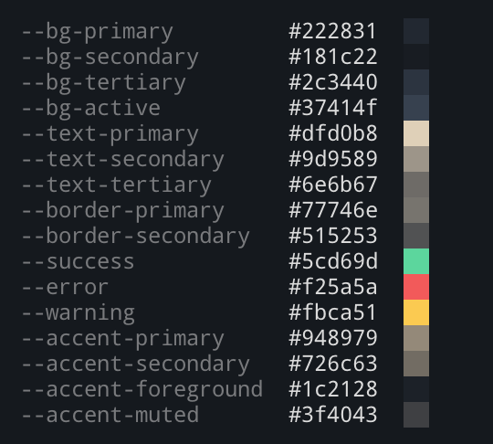

# Theme Generator

Generate a CSS theme for you site, by taking in 4 colors and using color math to expand to adjesent colors.

A great way of using this is browse [Color Hunt](https://colorhunt.co/), then using those to generate a theme.

## This is a houseplant program

This is a program I built for myself. I share this in the hopes someone else will find value. 

If you find a bug or small improvement, feel free to send a PR, but don't expect much from this project.

Here'a an image of a nice looking plant!

